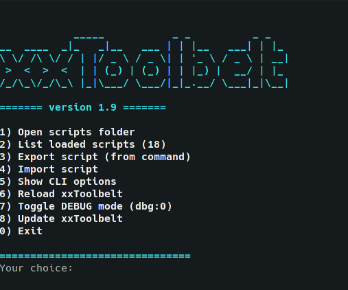
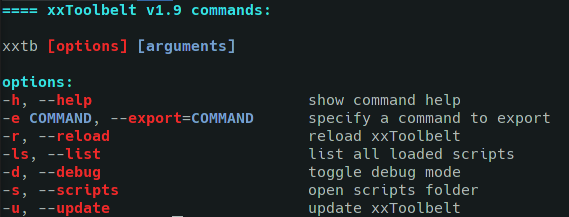

<p align="center"></p>
<h3 align="center">Organize your scripts </h3>
<hr>

  [](http://github.com/badges/stability-badges)

<h3 align="center">🛠 Powered by Bash 🛠</h3>

<p align="center">
  <a href="https://skillicons.dev">
    
  </a>
</p>

# xxToolbelt

## ✨ Description

The xxToolbelt is a simple yet powerful system for creating aliases, scripts, and tools in various programming and scripting languages. It aims to provide a cleaner and more efficient alternative to the traditional giant rc files that many of us rely on. This tool allows you to manage your custom commands and scripts effortlessly, making your development workflow more streamlined and organized. Remember when you had to write this small script that does X and then you forgot about it? With the xxToolbelt, you can easily manage and share your scripts with others.

Some of the key features of the xxToolbelt include:

- **No reloading of the shell** required when adding or modifying scripts (after the initial setup).
- **Support for multiple programming and scripting languages** (not limited to bash).
- **Easy to extend** and customize.
- Mechanism to **share snippets** with others.
- Adaptability to **different shells** (bash, zsh, fish, etc.).
- **Centralized requirements** for all your tools/scripts (e.g., Python requirements.txt).

## 📝 Table of Contents

- [xxToolbelt](#xxtoolbelt)
  - [✨ Description](#-description)
  - [📝 Table of Contents](#-table-of-contents)
  - [👍 Pros](#-pros)
  - [👎 Cons](#-cons)
  - [🛠️ Installation](#️-installation)
    - [Install with git](#install-with-git)
    - [Manual install](#manual-install)
    - [Install with wget](#install-with-wget)
  - [🗑️ Uninstall](#️-uninstall)
  - [📚 Usage](#-usage)
    - [TUI](#tui)
    - [CLI](#cli)
    - [Modifying scripts](#modifying-scripts)
    - [Adding new scripts](#adding-new-scripts)
    - [Adding new languages](#adding-new-languages)
    - [Change default script editor](#change-default-script-editor)
    - [Change scripts folder](#change-scripts-folder)
    - [Private scripts](#private-scripts)
    - [Change script scanning depth](#change-script-scanning-depth)
  - [🔍 Examples in Various Languages](#-examples-in-various-languages)
    - [Python](#python)
    - [Ruby](#ruby)
    - [Rust](#rust)
    - [R](#r)
    - [PowerShell Core](#powershell-core)
    - [Perl](#perl)
    - [Nodejs](#nodejs)
    - [Lua](#lua)
    - [Groovy](#groovy)
    - [Java](#java)
    - [Golang](#golang)
    - [Erlang](#erlang)
    - [Elixir](#elixir)
    - [Dlang](#dlang)
    - [CSharp](#csharp)
    - [Cpp](#cpp)
    - [Bash](#bash)
    - [TypeScript](#typescript)
    - [Janet](#janet)
    - [Zig](#zig)
    - [V](#v)
  - [⚙️ Compatability](#️-compatability)
  - [🚀 Roadmap](#-roadmap)
  - [🤝 Contribution](#-contribution)
  - [� License](#-license)
  - [🙏 Acknowledgements](#-acknowledgements)

## 👍 Pros

- Dynamic reloading without the need to reload the shell;
- Can be included in every shell (bash, zsh, fish etc.);
- Support multiple programming and scripting languages (everything, as long as you can create a shebang for it);
- Really easily extendible;
- You can write and reuse scripts using wide variety of languages;
- Works really well with interpreted languages;
- You can use centralized requirements for all your toolbelt - ex. Python requirements.txt.
- Portability;
- Easy version control;

## 👎 Cons

- Must maintain a lot of separate files instead of one big rc (might as well be a pro);
- Loading time of compiled languages will be slow and some functionality limited (but still better than the standard way);

## 🛠️ Installation

### Install with git

In your terminal as the current user type:

```bash
cd /tmp; git clone https://github.com/thereisnotime/xxToolbelt && mkdir "$HOME/.xxtoolbelt" && mv ./xxToolbelt/* "$HOME/.xxtoolbelt" && echo -ne "# START xxToolbelt\nsource \"$HOME/.xxtoolbelt/xxtoolbelt.sh\"\n# END xxToolbelt" >> "$HOME/.$(ps -p $$ -ocomm=)rc" && source "$HOME/.$(ps -p $$ -ocomm=)rc" && echo -ne "\n\e[1;32m======= xxToolbelt was installed. Try 'xxtb'\e[m\n"
```

### Manual install

In your **~/.bashrc** or **~/.zshrc** or whatever rc file you use paste (prefably in the end of the file):

```bash
# START xxToolbelt
source "$HOME/.xxtoobelt/xxtoolbelt.sh"
# END xxToolbelt
```

Clone (or symlink) the repository folder to your home directory (or wherever you want). Example:

```bash
git clone https://github.com/thereisnotime/xxToolbelt
cp -r ./xxToolbelt ~/.xxtoolbelt
```

Reload your terminal.

### Install with wget

```bash
wget --no-check-certificate -O xxToolbelt.tar.gz https://github.com/thereisnotime/xxToolbelt/archive/main.tar.gz && tar -xf xxToolbelt.tar.gz && mkdir "$HOME/.xxtoolbelt" && mv ./xxToolbelt-main/* "$HOME/.xxtoolbelt" && echo -ne "# START xxToolbelt\nsource \"$HOME/.xxtoolbelt/xxtoolbelt.sh\"\n# END xxToolbelt" >> "$HOME/.$(ps -p $$ -ocomm=)rc" && source "$HOME/.$(ps -p $$ -ocomm=)rc" && echo -ne "\n\e[1;32m======= xxToolbelt was installed. Try 'xxtb'\e[m\n"
```

## 🗑️ Uninstall

1. Remove the lines from your rc file.
2. (optional) Remove the folder for your scripts `rm -rf ~/.xxtoolbelt`.

## 📚 Usage

The main configuration is located in xxtoobelt.sh

### TUI

You can start TUI with:

```bash
xxtb
```



### CLI

You can view CLI help with:

```bash
xxtb -h
```



### Modifying scripts

For example if your script's name is xxtemplate-py.py type:

```bash
xxedit-xxtemplate-py
```

This will open your code editor (by default VSCode)

Save the file - that's all - no need to reload anything.

**NOTE:** The *xxedit-* command is automatically generated for each script.

### Adding new scripts

1. Add the new script with the proper extension to the correct language folder (or create one). **It is recommended to use the templates and have the requirements (README.md in the language folder)** because the shebang is important.
2. Reload your shell or open a new terminal or type:

```bash
xxtb-load
```

**NOTE:** After the first load, you don't need to reload the shell or open a new terminal every time you change the script.

### Adding new languages

1. Create the appropriate folder in **/.xxtoolbelt/scripts/**
2. Whitelist its extension in your RC file in the **XXTOOLBELT_SCRIPTS_WHITELIST** array.
3. Make sure that the shebang you are using works (test with bash ./yourscript.yourlanguage).
4. Reload your shell or open a new terminal.

### Change default script editor

Edit **XXTOOLBELT_SCRIPTS_EDITOR** in your RC file.

### Change scripts folder

Edit **XXTOOLBELT_SCRIPTS_FOLDER** in your RC file.

### Private scripts

If you have any sensitive information in your scripts and use git, you can add **".private"** before the script extension to ignore it for the git repository. Example **xxmyscript.sh -> xxmyscript.private.sh**. This will not affect the command, you will still call it with xxmyscript.

### Change script scanning depth

By default it is 2 levels (so you can use nested folders for your script's libraries). You can edit **XXTOOLBELT_SCANNING_DEPTH** in your RC file.

## 🔍 Examples in Various Languages

Here you can find examples of scripts in various languages that you can use with the xxToolbelt:

### Python

Check the [Python README](scripts/python/README.md) for more information.

### Ruby

Check the [Ruby README](scripts/ruby/README.md) for more information.

### Rust

Check the [Rust README](scripts/rust/README.md) for more information.

### R

Check the [R README](scripts/r/README.md) for more information.

### PowerShell Core

Check the [PowerShell README](scripts/powershell/README.md) for more information.

### Perl

Check the [Perl README](scripts/perl/README.md) for more information.

### Nodejs

Check the [Nodejs README](scripts/node/README.md) for more information.

### Lua

Check the [Lua README](scripts/lua/README.md) for more information.

### Groovy

Check the [Groovy README](scripts/groovy/README.md) for more information.

### Java

Check the [Java README](scripts/java/README.md) for more information.

### Golang

Check the [Golang README](scripts/golang/README.md) for more information.

### Erlang

Check the [Erlang README](scripts/erlang/README.md) for more information.

### Elixir

Check the [Elixir README](scripts/elixir/README.md) for more information.

### Dlang

Check the [Dlang README](scripts/dlang/README.md) for more information.

### CSharp

Check the [CSharp README](scripts/csharp/README.md) for more information.

### Cpp

Check the [Cpp README](scripts/cpp/README.md) for more information.

### Bash

Check the [Bash README](scripts/bash/README.md) for more information.

### TypeScript

Check the [TypeScript README](scripts/ts/README.md) for more information.

### Janet

Check the [Janet README](scripts/janet/README.md) for more information.

### Zig

Check the [Zig README](scripts/zig/README.md) for more information.

### V

Check the [V README](scripts/v/README.md) for more information.

## ⚙️ Compatability

Should work fine with all POSIX compliant shells (and some of the not fully compliant ones). Tested with:

- Debian/Ubuntu/Arch/Manjaro
- bash/zsh

## 🚀 Roadmap

- [x] Create oneliner for the installation of xxToolbelt.
- [ ] Add Julia.
- [ ] Add Kotlin.
- [ ] Add Haskell.
- [ ] Add Swift.
- [ ] Add Nim.
- [ ] Add Fortran.
- [ ] Add COBOL.
- [ ] Add Clojure.
- [ ] Add Scala.
- [ ] Add Dart.
- [ ] Add Delphi.
- [ ] Create dependency examples where they are missing.
- [ ] Test on macOS.
- [ ] Test on BSD.
- [ ] Add support for PowerShell Core.
- [ ] Implement architecture that allows easy installation of "script modules" from git repositories by URL.
- [ ] Add examples for .env secrets management for private scripts.
- [ ] Create a management menu for managing installed scripts.
- [x] Create a mechanism for easily exchanging scripts with peers.

## 🤝 Contribution

We welcome contributions to xxToolbelt! You can help by creating issues or submitting pull requests. If scripting isn't your thing, you can still support the project by testing it with different shells, terminals, and OS versions. If you have questions or need assistance, please open an issue in the repository.

## 📜 License

Check the [LICENSE](LICENSE) file for more information.

## 🙏 Acknowledgements

- GitHub [gitignore](https://github.com/github/gitignore)
