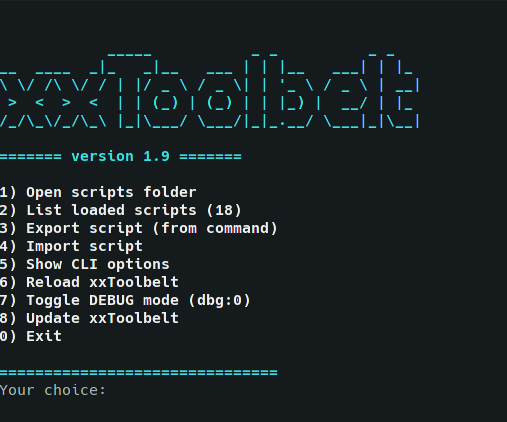
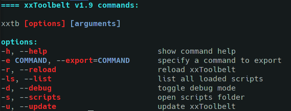

# xxToolbelt

- [xxToolbelt](#xxtoolbelt)
- [Description](#description)
    - [TUI](#tui)
    - [CLI](#cli)
- [Pros](#pros)
- [Cons](#cons)
- [Installation](#installation)
  - [Manual install](#manual-install)
  - [Install with git](#install-with-git)
  - [Install with wget](#install-with-wget)
- [Uninstall](#uninstall)
- [Usage](#usage)
  - [Modifying scripts](#modifying-scripts)
  - [Adding new scripts](#adding-new-scripts)
  - [Adding new languages](#adding-new-languages)
  - [Change default script editor](#change-default-script-editor)
  - [Change scripts folder](#change-scripts-folder)
  - [Private scripts](#private-scripts)
  - [Change script scanning depth](#change-script-scanning-depth)
- [Compatability](#compatability)
- [Roadmap](#roadmap)

# Description
The base for a simple system for creating aliases/scripts/tools in various programming and scripting languages. Like aliases but on steroids. The main goal is to kill the giant rc files that a lot of us use and to offer a nice replacement.

### TUI
You can view TUI with:
```
xxtb
```


### CLI
You can view CLI with:
```
xxtb -h
```


# Pros
- Dynamic reloading without the need to reload the shell;
- Can be included in every shell (bash, zsh, fish etc.);
- Support multiple programming and scripting languages (everything, as long as you can create a shebang for it);
- Really easily extendible;
- You can write and reuse scripts using wide variety of languages;
- Works really well with interpreted languages;
- You can use centralized requirements for all your toolbelt - ex. Python requirements.txt.
- Portability;
- Easy version control;

# Cons
- Must maintain a lot of separate files instead of one big rc;
- Loading time of compiled languages will be slow and some funcitonality limited (but still better than the standard way);


# Installation
## Manual install
1. In your **~/.bashrc** or **~/.zshrc** or whatever rc file you use paste (prefably in the end of the file):
```bash
# START xxToolbelt
source "$HOME/.xxtoobelt/xxtoolbelt.sh"
# END xxToolbelt
```
1. Clone (or symlink) the repository folder to your home directory (or wherever you want). Example:
```bash
git clone https://github.com/thereisnotime/xxToolbelt
cp -r ./xxToolbelt ~/.xxtoolbelt
```
3. Reload your terminal.

## Install with git
```bash
cd /tmp; git clone https://github.com/thereisnotime/xxToolbelt && mkdir "$HOME/.xxtoolbelt" && mv ./xxToolbelt/* "$HOME/.xxtoolbelt" && echo -ne "# START xxToolbelt\nsource \"$HOME/.xxtoolbelt/xxtoolbelt.sh\"\n# END xxToolbelt" >> "$HOME/.$(ps -p $$ -ocomm=)rc" && source "$HOME/.$(ps -p $$ -ocomm=)rc" && echo -ne "\n\e[1;32m======= xxToolbelt was installed. Try 'xxtb'\e[m\n"
```

## Install with wget
```bash
wget --no-check-certificate -O xxToolbelt.tar.gz https://github.com/thereisnotime/xxToolbelt/archive/main.tar.gz && tar -xf xxToolbelt.tar.gz && mkdir "$HOME/.xxtoolbelt" && mv ./xxToolbelt-main/* "$HOME/.xxtoolbelt" && echo -ne "# START xxToolbelt\nsource \"$HOME/.xxtoolbelt/xxtoolbelt.sh\"\n# END xxToolbelt" >> "$HOME/.$(ps -p $$ -ocomm=)rc" && source "$HOME/.$(ps -p $$ -ocomm=)rc" && echo -ne "\n\e[1;32m======= xxToolbelt was installed. Try 'xxtb'\e[m\n"
```

# Uninstall
1. Remove the lines from your rc file.
2. (optional) Remove the folder for your scripts.
# Usage
The main configuration is located in xxtoobelt.sh
## Modifying scripts
1. For example if your script's name is xxtemplate-py.py type:
```bash
xxedit-xxtemplate-py
```
This will open your code editor (by default VSCode)
2. Save the file - that's all - no need to reload anything.

## Adding new scripts
1. Add the new script with the proper extension to the correct language folder (or create one). **It is recommended using the templates and have the requirements (README.md in the language folder)** because the shebang is importnat.
2. Reload your shell or open a new terminal or type:
```bash
xxtb-load
```
## Adding new languages
1. Create the appropriate folder in **/.xxtoolbelt/scripts/**
2. Whitelist its extension in your RC file in the **XXTOOLBELT_SCRIPTS_WHITELIST** array.
3. Make sure that the shebang you are using works (test with bash ./yourscript.yourlanguage).
   
## Change default script editor
1. Edit **XXTOOLBELT_SCRIPTS_EDITOR** in your RC file.

## Change scripts folder
1. Edit **XXTOOLBELT_SCRIPTS_FOLDER** in your RC file.

## Private scripts
If you have any sensitive information in your scripts and use git, you can add **".private"** before the script extension to ignore it for the git repository. Example **xxmyscript.sh -> xxmyscript.private.sh**. This will not affect the command, you will still call it with xxmyscript.
## Change script scanning depth
1. By default it is 2 levels. You can edit **XXTOOLBELT_SCANNING_DEPTH** in your RC file.

# Compatability
Should work fine with all POSIX compliant shells (and some of the not fully compliant ones). Tested with:
- Debian/Ubuntu/Arch/Manjaro
- bash/zsh


# Roadmap
- [ ] Create oneliner for the installation.
- [ ] Create templates for even more languages.
- [ ] Test on macOS and BSD.
- [ ] Implement architecture that allows easy installation of "script modules" from git repositories by URL.
- [ ] Create a management menu for managing installed scripts.
- [ ] Create a mechanism for easily exchanging scripts with peers.


 