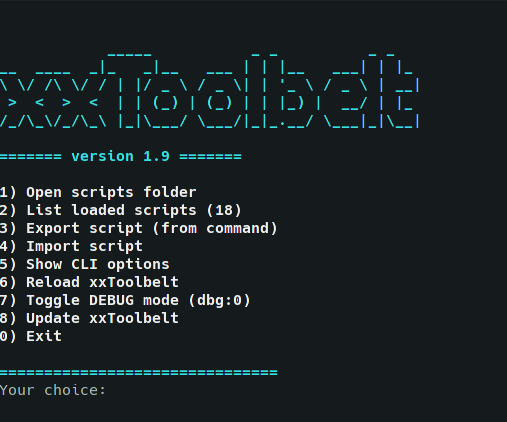
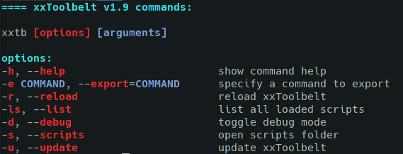

<p align="center"></p>
<h3 align="center">Organize your scripts </h3>
<hr>

[](https://github.com/thereisnotime/xxToolbelt/actions/workflows/lint.yaml)   [](http://github.com/badges/stability-badges)

<h3 align="center">🛠 Powered by Bash 🛠</h3>

<p align="center">
  <a href="https://skillicons.dev">
    
  </a>
</p>

# xxToolbelt

## ✨ Description

The **xxToolbelt** is a simple yet powerful system for organizing scripts and tools in various programming and scripting languages **entirely written in Bash**. It aims to provide a **cleaner and more efficient** alternative to the traditional giant rc (.bashrc, .zshrc etc.) files that many of us rely on. This tool allows you to **manage your custom commands and scripts** effortlessly, making your development workflow more streamlined and organized. Remember when you had to write this small script that does X and then you forgot about it? With the **xxToolbelt**, you can easily manage and share your scripts with others so you won't lose them or forget about them anymore.

xxToolbelt uses **symlinks** in `~/.local/bin` instead of shell aliases, which means your scripts work **everywhere** — interactive shells, scripts, AI tools (Claude CLI, Copilot, etc.), cron jobs, and any process that uses PATH.

Some of the key features of the **xxToolbelt** include:

- **Works everywhere** — not just interactive shells, but AI tools, scripts, cron, etc.
- **Zero shell startup overhead** — no scanning on every terminal open.
- **Support for multiple programming and scripting languages** (not limited to bash).
- **Easy to extend** and customize.
- Mechanism to **share snippets** with others.
- Adaptability to **different shells** (bash, zsh, fish, etc.).
- **Shared or isolated Python venvs** — per-belt isolation by default, or opt into a single shared venv with [uv](https://github.com/astral-sh/uv) support for faster installs.

Check out the demos:

- [Using programming languages as scripts](#adding-new-scripts)
- [Exporting scripts for sharing](#exporting-scripts)

## 📝 Table of Contents

- [xxToolbelt](#xxtoolbelt)
  - [✨ Description](#-description)
  - [📝 Table of Contents](#-table-of-contents)
  - [👍 Pros](#-pros)
  - [👎 Cons](#-cons)
  - [🛠️ Installation](#️-installation)
    - [Install with git](#install-with-git)
    - [Manual install](#manual-install)
    - [Install with wget](#install-with-wget)
  - [🗑️ Uninstall](#️-uninstall)
  - [📚 Usage](#-usage)
    - [TUI](#tui)
    - [CLI](#cli)
    - [Adding new scripts](#adding-new-scripts)
    - [Exporting scripts](#exporting-scripts)
    - [Adding new languages](#adding-new-languages)
    - [Change default script editor](#change-default-script-editor)
    - [Change scripts folder](#change-scripts-folder)
    - [Private scripts](#private-scripts)
    - [Belts (External Toolbelts)](#belts-external-toolbelts)
    - [Library files](#library-files)
    - [Debug mode](#debug-mode)
    - [Change script scanning depth](#change-script-scanning-depth)
    - [Using with AI Tools](#using-with-ai-tools)
  - [📖 Documentation](#-documentation)
  - [⚙️ Compatability](#️-compatability)
  - [🚀 Roadmap](#-roadmap)
  - [🔍 Examples in Various Languages](#-examples-in-various-languages)
    - [Python](#python)
    - [Ruby](#ruby)
    - [Rust](#rust)
    - [R](#r)
    - [PowerShell Core](#powershell-core)
    - [Perl](#perl)
    - [Nodejs](#nodejs)
    - [Lua](#lua)
    - [Groovy](#groovy)
    - [Java](#java)
    - [Golang](#golang)
    - [Erlang](#erlang)
    - [Elixir](#elixir)
    - [Dlang](#dlang)
    - [CSharp](#csharp)
    - [Cpp](#cpp)
    - [Bash](#bash)
    - [TypeScript](#typescript)
    - [Janet](#janet)
    - [Zig](#zig)
    - [V](#v)
  - [🤝 Contributing](#-contributing)
  - [📜 License](#-license)
  - [🙏 Acknowledgements](#-acknowledgements)

## 👍 Pros

- No dependencies except Bash;
- **Works with AI tools** (Claude CLI, Copilot, etc.) — not just interactive shells;
- Zero shell startup overhead — scripts are synced once, not on every terminal;
- Can be included in every shell (bash, zsh, fish etc.);
- Support multiple programming and scripting languages (everything, as long as you can create a shebang for it);
- Really easily extendible and customizable;
- You can write and reuse scripts using wide variety of languages;
- Works really well with interpreted languages;
- Shared or per-belt Python venvs with automatic uv/pip management;
- Portability - its one file and your scripts folder (optional);
- Easy version control;

## 👎 Cons

- Must maintain a lot of separate files instead of one big rc (might as well be a pro);
- Loading time of compiled languages will be slow and some functionality limited (but still better than the standard way);

## 🛠️ Installation

### Install with git

In your terminal as the current user type:

```bash
git clone git@github.com:thereisnotime/xxToolbelt.git "$HOME/.xxtoolbelt" && echo -ne "# START xxToolbelt\nsource \"$HOME/.xxtoolbelt/xxtoolbelt.sh\"\n# END xxToolbelt" >> "$HOME/.$(basename "$(ps -p $$ -ocomm=)")rc" && source "$HOME/.$(basename "$(ps -p $$ -ocomm=)")rc" && xxtb --sync && echo -ne "\n\e[1;32m======= xxToolbelt was installed. Try 'xxtb'\e[m\n"
```

### Manual install

In your **~/.bashrc** or **~/.zshrc** or whatever rc file you use paste (prefably in the end of the file):

```bash
# START xxToolbelt
source "$HOME/.xxtoolbelt/xxtoolbelt.sh"
# END xxToolbelt
```

Clone (or symlink) the repository folder to your home directory (or wherever you want). Example:

```bash
git clone git@github.com:thereisnotime/xxToolbelt.git "$HOME/.xxtoolbelt"
```

Reload your terminal.

### Install with wget

```bash
cd "${TMPDIR:-/tmp}" && wget -O xxToolbelt.tar.gz https://github.com/thereisnotime/xxToolbelt/archive/main.tar.gz && tar -xf xxToolbelt.tar.gz && mkdir "$HOME/.xxtoolbelt" && mv ./xxToolbelt-main/* "$HOME/.xxtoolbelt" && echo -ne "# START xxToolbelt\nsource \"$HOME/.xxtoolbelt/xxtoolbelt.sh\"\n# END xxToolbelt" >> "$HOME/.$(basename "$(ps -p $$ -ocomm=)")rc" && source "$HOME/.$(basename "$(ps -p $$ -ocomm=)")rc" && xxtb --sync && echo -ne "\n\e[1;32m======= xxToolbelt was installed. Try 'xxtb'\e[m\n"
```

## 🗑️ Uninstall

1. Remove the lines from your rc file.
2. Remove symlinks: `find ~/.local/bin -lname '*/.xxtoolbelt/*' -delete`
3. (optional) Remove the folder for your scripts `rm -rf ~/.xxtoolbelt`.

## 📚 Usage

The main configuration is located in `xxtoolbelt.sh`. For deeper topics see the [`docs/`](docs/) folder: [Advanced Usage](docs/advanced-usage.md), [Belt Authoring](docs/belt-authoring.md), [Python Venv](docs/python-venv.md).

### TUI

You can start TUI with:

```bash
xxtb
```



### CLI

You can view CLI help with:

```bash
xxtb -h
```



### Adding new scripts

1. Add the new script with the proper extension to the correct language folder (or create one). **It is recommended to use the templates and have the requirements (README.md in the language folder)** because the shebang is important.
2. Sync scripts:

```bash
xxtb --sync
```

Example:


### Exporting scripts

You can export your scripts to a snippet with:

```bash
xxtb -e [scriptname]
```

Example:


**NOTE:** After syncing, you don't need to reload the shell or re-sync when you modify a script — just run it. Re-sync only when adding or removing scripts.

### Adding new languages

1. Create the appropriate folder in **/.xxtoolbelt/scripts/**
2. Whitelist its extension in your RC file in the **XXTOOLBELT_SCRIPTS_WHITELIST** array.
3. Make sure that the shebang you are using works (test with bash ./yourscript.yourlanguage).
4. Reload your shell or open a new terminal.

### Change default script editor

Edit **XXTOOLBELT_SCRIPTS_EDITOR** in your RC file.

### Change scripts folder

Edit **XXTOOLBELT_SCRIPTS_FOLDER** in your RC file.

### Private scripts

Add `.private` before the extension to gitignore a script while keeping it synced and callable by its clean name:

```
xxmy-tokens.private.sh   →  callable as: xxmy-tokens
xxwork-api.private.py    →  callable as: xxwork-api
```

### Library files

Files whose name starts with `_` are treated as shared libraries and are never symlinked into `~/.local/bin`. Use them for helpers sourced or imported by other scripts:

```
scripts/bash/_colors.sh       # sourced by other scripts, not callable directly
scripts/python/_api_client.py # imported by other scripts
```

### Belts (External Toolbelts)

Belts allow you to manage external toolbelt repositories — either git repos or local folders — and have their scripts automatically synced alongside your core xxToolbelt scripts. This is useful for:

- **Organization-specific toolbelts** — share scripts across your team
- **Project-specific scripts** — keep them in the project repo, register as a belt
- **Separating concerns** — personal scripts vs work scripts vs hobby projects

#### Adding a Belt

**From a git repository:**

```bash
xxtb -a mytools git@github.com:myorg/my-toolbelt.git
```

This clones the repo to `~/.xxtoolbelt/belts/mytools/` and syncs all scripts.

**From a local folder:**

```bash
xxtb -a localtools /path/to/my/scripts
```

This registers the local path (no cloning) and syncs scripts from there.

#### Listing Belts

```bash
xxtb -r
```

Shows all registered belts with their folders:

```text
work (local) -> /home/user/projects/work-toolbelt
  └─ work-bash
  └─ work-python
team (git) -> git@github.com:myorg/team-toolbelt.git
  └─ team-bash
  └─ team-node
```

#### Enable/Disable Belts

Temporarily disable a belt without removing it:

```bash
xxtb --disable-belt mytools
xxtb --enable-belt mytools
```

Disabled belts are skipped during sync and update but remain registered.

#### Removing a Belt

```bash
xxtb --remove-belt mytools
```

This removes the registration, cleans up symlinks, and (for git belts) deletes the cloned directory.

#### Updating Belts

When you run `xxtb -u`, xxToolbelt updates itself **and** runs `git pull` on all git-based belts, then re-syncs everything.

#### Belt Structure

Language folders sit at the repo root. Scripts must be named `xx*`. Files named `_*` are libraries, not synced.

```text
my-toolbelt/
├── bash/
│   ├── xxmy-script.sh
│   ├── xxanother.sh
│   └── _helpers.sh        # library, not synced
├── python/
│   ├── xxpytool.py
│   ├── requirements.txt   # auto-installs into a venv on sync
│   └── .shared-venv       # optional: opt into shared ~/.xxtoolbelt/.venv
└── README.md
```

Scripts are synced with the belt name as prefix: `mytools-bash/xxmy-script.sh` becomes available as `xxmy-script` in your PATH.

If `python/requirements.txt` exists, xxToolbelt automatically creates a venv and installs deps using [uv](https://github.com/astral-sh/uv) (if available) or pip. Add a `.shared-venv` marker to share one venv across all belts instead of one per belt. See [docs/python-venv.md](docs/python-venv.md) for details.

For a complete belt authoring guide see [docs/belt-authoring.md](docs/belt-authoring.md).

#### Interactive Management

You can also manage belts through the TUI menu:

```bash
xxtb  # then select option 9) Manage belts
```

### Debug mode

Toggle verbose logging for sync operations:

```bash
xxtb --debug   # enable
xxtb --debug   # toggle off
```

Prints every symlink created, every stale link removed, and every belt script registered. See [docs/advanced-usage.md](docs/advanced-usage.md) for more.

### Change script scanning depth

By default it is 3 levels (so you can use nested folders for your script's libraries). You can edit **XXTOOLBELT_SCANNING_DEPTH** in your RC file.

### Using with AI Tools

xxToolbelt v2.0+ uses symlinks in `~/.local/bin` instead of shell aliases. This is critical because **AI tools don't load `.bashrc` or `.profile`** — they inherit the PATH environment variable from the terminal session that launched them.

**How it works:**

1. You open a terminal → `.bashrc` sources `xxtoolbelt.sh` → `~/.local/bin` is added to PATH
2. You run an AI tool from that terminal → it inherits PATH → your scripts are available
3. The AI tool runs `xxmyscript` → finds the symlink in `~/.local/bin` → executes your script

#### Claude Code (CLI)

Add to `~/.claude/settings.json`:

```json
{
  "env": {
    "PATH": "${HOME}/.local/bin:${PATH}"
  },
  "permissions": {
    "allow": [
      "Bash(xx*:*)"
    ]
  }
}
```

[Claude Code Settings Docs](https://docs.anthropic.com/en/docs/claude-code/settings)

#### OpenAI Codex CLI

Add to `~/.codex/config.toml`:

```toml
[shell_environment_policy]
set = { PATH = "/home/youruser/.local/bin:/usr/bin:/bin" }
```

[Codex Config Reference](https://github.com/openai/codex)

#### Aider

Add to `~/.aider.conf.yml`:

```yaml
set-env:
  - PATH=/home/youruser/.local/bin:$PATH
```

[Aider Config Docs](https://aider.chat/docs/config/aider_conf.html)

#### Cursor / VS Code

Add to `settings.json`:

```json
{
  "terminal.integrated.env.linux": {
    "PATH": "${env:HOME}/.local/bin:${env:PATH}"
  },
  "terminal.integrated.env.osx": {
    "PATH": "${env:HOME}/.local/bin:${env:PATH}"
  }
}
```

#### Cron / Systemd

```bash
# crontab
PATH=/home/youruser/.local/bin:/usr/bin:/bin
* * * * * xxmyscript

# systemd unit
[Service]
Environment="PATH=/home/youruser/.local/bin:/usr/bin:/bin"
ExecStart=/home/youruser/.local/bin/xxmyscript
```

## ⚙️ Compatability

Should work fine with all POSIX compliant shells (and some of the not fully compliant ones). Tested with:

- Debian/Ubuntu/Arch/Manjaro
- bash/zsh

## 🚀 Roadmap

- [x] Create oneliner for the installation of xxToolbelt.
- [ ] Add Julia.
- [ ] Add Kotlin.
- [ ] Add Haskell.
- [ ] Add Swift.
- [ ] Add Nim.
- [ ] Add Fortran.
- [ ] Add COBOL.
- [ ] Add Clojure.
- [ ] Add Scala.
- [ ] Add Dart.
- [ ] Add Delphi.
- [ ] Create dependency examples where they are missing.
- [ ] Test on macOS.
- [ ] Test on BSD.
- [ ] Add support for PowerShell Core.
- [x] Implement architecture that allows easy installation of "script modules" from git repositories by URL (Belts).
- [ ] Add examples for .env secrets management for private scripts.
- [ ] Create a management menu for managing installed scripts.
- [x] Create a mechanism for easily exchanging scripts with peers.
- [x] Shared Python venv with uv support for belts.


## 🔍 Examples in Various Languages

Here you can find examples of scripts in various languages that you can use with the xxToolbelt:

### Python

Check the [Python README](scripts/python/README.md) for more information.

### Ruby

Check the [Ruby README](scripts/ruby/README.md) for more information.

### Rust

Check the [Rust README](scripts/rust/README.md) for more information.

### R

Check the [R README](scripts/r/README.md) for more information.

### PowerShell Core

Check the [PowerShell README](scripts/powershell/README.md) for more information.

### Perl

Check the [Perl README](scripts/perl/README.md) for more information.

### Nodejs

Check the [Nodejs README](scripts/node/README.md) for more information.

### Lua

Check the [Lua README](scripts/lua/README.md) for more information.

### Groovy

Check the [Groovy README](scripts/groovy/README.md) for more information.

### Java

Check the [Java README](scripts/java/README.md) for more information.

### Golang

Check the [Golang README](scripts/golang/README.md) for more information.

### Erlang

Check the [Erlang README](scripts/erlang/README.md) for more information.

### Elixir

Check the [Elixir README](scripts/elixir/README.md) for more information.

### Dlang

Check the [Dlang README](scripts/dlang/README.md) for more information.

### CSharp

Check the [CSharp README](scripts/csharp/README.md) for more information.

### Cpp

Check the [Cpp README](scripts/cpp/README.md) for more information.

### Bash

Check the [Bash README](scripts/bash/README.md) for more information.

### TypeScript

Check the [TypeScript README](scripts/ts/README.md) for more information.

### Janet

Check the [Janet README](scripts/janet/README.md) for more information.

### Zig

Check the [Zig README](scripts/zig/README.md) for more information.

### V

Check the [V README](scripts/v/README.md) for more information.

## 🤝 Contributing

We welcome contributions from everyone! See [CONTRIBUTING.md](CONTRIBUTING.md) for guidelines.

**Quick ways to contribute:**

- Add scripts in your favorite language
- Test on different shells, terminals, or operating systems
- Improve documentation
- Report bugs or suggest features
- Create and share your own belts

## 📖 Documentation

| Guide | Description |
|---|---|
| [Advanced Usage](docs/advanced-usage.md) | Debug mode, private/library scripts, export/import, scanning depth, cron/systemd |
| [Belt Authoring](docs/belt-authoring.md) | How to write and publish a belt, shebang patterns, venv setup, authoring checklist |
| [Python Venv](docs/python-venv.md) | Per-belt vs shared venv, uv installation, migration steps, troubleshooting |

## 📜 License

[PolyForm Noncommercial License 1.0.0](LICENSE) — free for personal use, research, education, and non-profits. Commercial use is not permitted.

## 🙏 Acknowledgements

- GitHub [gitignore](https://github.com/github/gitignore)
